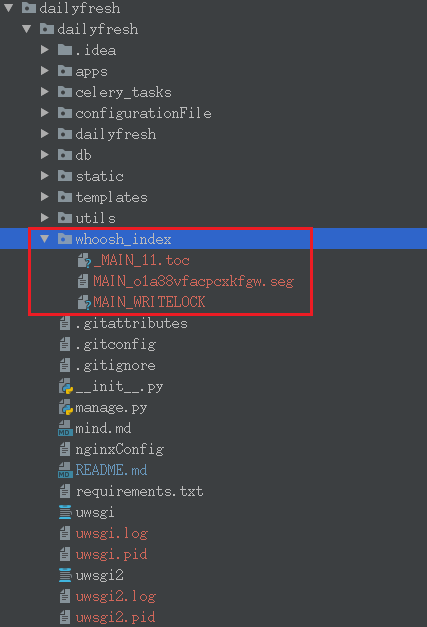
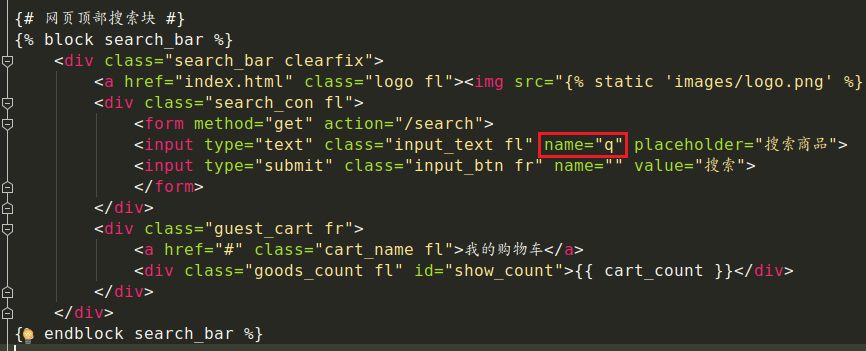
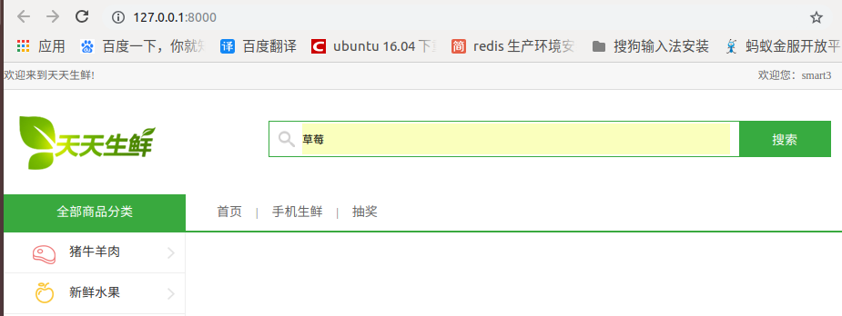

# 全文检索引擎
- [settings文件](../dailyfresh/settings.py)  
全文检索不同于特定字段的模糊查询，使用全文检索的效率更高，并且能够对于中文进行分词处理
- haystack：全文检索的框架，支持whoosh、solr、Xapian、Elasticsearc四种全文检索引擎，点击查看[官方网站](http://haystacksearch.org/)
- whoosh：纯Python编写的全文搜索引擎，虽然性能比不上sphinx、xapian、Elasticsearc等，但是无二进制包，程序不会莫名其妙的崩溃，对于小型的站点，whoosh已经足够使用，点击查看[whoosh文档](https://whoosh.readthedocs.io/en/latest/)
- jieba：一款免费的中文分词包，如果觉得不好用可以使用一些收费产品
    - 分词
        ```
        如： 很不错的草莓
        分解成：很/不错/的/草莓
        ```
- ### 安装和配置
    1. 虚拟环境中安装需要的包
        ```
        pip install django-haystack
        pip install whoosh
        pip install jieba
        ```
    2. 修改dailyfresh/settings.py文件，安装应用haystack
        ```
        INSTALLED_APPS = (
            ...
            'haystack',
        )
        ```
    3. 在dailyfresh/settings.py文件中配置搜索引擎
        ```
        ...
        HAYSTACK_CONNECTIONS = {
            'default': {
                #使用whoosh引擎--jieba中心分词包
                'ENGINE': 'haystack.backends.whoosh_cn_backend.WhooshEngine',
                #索引文件路径
                'PATH': os.path.join(BASE_DIR, 'whoosh_index'),
            }
        }
        #当添加、修改、删除数据时，自动生成索引
        HAYSTACK_SIGNAL_PROCESSOR = 'haystack.signals.RealtimeSignalProcessor'
        ```
    4. 在dailyfresh/urls.py中添加搜索的配置[dailyfresh.urls](../dailyfresh/urls.py)  
        `url(r'^search/', include('haystack.urls')),`
- ### 创建引擎及索引
    - 在那个应用中使用到索引就在目录下创建[search_indexes.py](../apps/goods/search_indexes.py)文件(固定写法)  
        ```
        dailyfresh/apps/goods目录结构：
        ------------------------------
        |-- __init__.py
        |-- __pycache__
        |-- admin.py
        |-- migrations
        |   |-- 0001_initial.py
        |   |-- __init__.py
        |   `-- __pycache__
        |       |-- 0001_initial.cpython-36.pyc
        |       `-- __init__.cpython-36.pyc
        |-- models.py
        |-- search_indexes.py    # this
        |-- tests.py
        |-- urls.py
        `-- views.py
        ```
        ```python
        # search_indexes.py
        # --------------------------
        # 定义索引类
        from haystack import indexes
        # 导入模型类
        from goods.models import GoodsSKU
        
        #指定对于某个类的某些数据建立索引
        class GoodsSKUIndex(indexes.SearchIndex, indexes.Indexable):
        # 索引字段
        # use_template=True指定根据表中的那些字段建立索引文件，把说明放在一个文件中
        text = indexes.CharField(document=True, use_template=True)
    
        def get_model(self):
            # 返回你的模型类
            return GoodsSKU
    
        # 建立索引的数据
        def index_queryset(self, using=None):
            return self.get_model().objects.all()
        ```
    - 在django项目中templates目录下创建`search/indexes/goods/`目录(固定写法)   
        ```
        # search/indexes/目录添加你用到的应用的文件夹,命名要和应用名字一样
        # 如用到了goods,那么就在目录中添加goods目录
        # goods目录中的文件名字也是固定的： 
        # 应用名字 + info_text.txt = goodsinfo_text.txt 
        
        # templates/search/indexes目录结构:
        |-- search
        |   |-- indexes
        |   |   `-- goods
        |   |       `-- goodssku_text.txt
        |   |-- search.html
        |   `-- search1.html
        ```
    - 目录中创建[goodsinfo_text.txt](../templates/search/indexes/goods/goodssku_text.txt)  
        ```
        # 指定数据表中的那些字段建立索引数据
        {{ object.name }} # 根据商品的名称建立索引
        {{ object.desc }} # 根据商品的简介建立索引
        {{ object.goods.detail }} # 根据商品的详情建立索引
        ```
- ### 使用jieba分词设置
    - 找项目虚拟环境中的haystack目录  
    `cd`  
    `cd .virtualenv/虚拟环境名字/lib/python3.6/site-packages/haystack`  
    `如： /home/hyw/.virtualenvs/bj18_py3/lib/python3.6/site-packages/haystack`
    - 在上面的目录中创建[ChineseAnalyzer.py]()文件,写入下面的代码  
        ```python
        import jieba
        from whoosh.analysis import Tokenizer, Token
        
        class ChineseTokenizer(Tokenizer):
            def __call__(self, value, positions=False, chars=False,
                         keeporiginal=False, removestops=True,
                         start_pos=0, start_char=0, mode='', **kwargs):
                t = Token(positions, chars, removestops=removestops, mode=mode,
                          **kwargs)
                seglist = jieba.cut(value, cut_all=True)
                for w in seglist:
                    t.original = t.text = w
                    t.boost = 1.0
                    if positions:
                        t.pos = start_pos + value.find(w)
                    if chars:
                        t.startchar = start_char + value.find(w)
                        t.endchar = start_char + value.find(w) + len(w)
                    yield t
        
        def ChineseAnalyzer():
            return ChineseTokenizer()
        ```
    - 复制whoosh_backend.py文件修改为[whoosh_cn_backend.py](./conf/whoosh_cn_backend.py)  
        `sudo cp whoosh_backend.py whoosh_cn_backend.py`
    - 打开复制出来的新文件whoosh_cn_backend.py,引入中文分词类,内部采用Jieba分词  
        `from .ChineseAnalyzer import ChineseAnalyzer`
    - 更改词语分词类
        ```
        查找
        analyzer=StemmingAnalyzer()
        改为
        analyzer=ChineseAnalyzer()
        ```    
    - 初始化索引数据  
        `python manage.py rebuild_index`
    - 索引生成后目录结构如下图:  
        
- ### 全文检索引擎使用,当前项目中使用
    按照配置，在admin管理中添加数据后，会自动为数据创建索引，可以直接进行搜索，可以先创建一些测试数据  
    1. 在[dailyfresh/urls.py](../dailyfresh/urls.py)中设置,添加路由  
        `url(r'^search', include('haystack.urls')), # 全文检索框架`
    2. 在需要用到搜索功能的页面的搜索输入框中加入name=‘q’属性  
        > 参数q表示搜索内容，传递到模板中的数据为query  
        
    3. 自定义搜索结果模板：在templates/search/目录下创建[search.html](../templates/search/search.html)  
        搜索结果进行分页，视图向模板中传递的上下文如下：
        ```
        query：搜索关键字
        page：当前页的page对象
        paginator：分页paginator对象
        视图接收的参数如下：
        
        参数q表示搜索内容，传递到模板中的数据为query
        参数page表示当前页码
        ```
        点击打开[search.html](../templates/search/search.html)查看详细代码
    4. 显示
        
        
